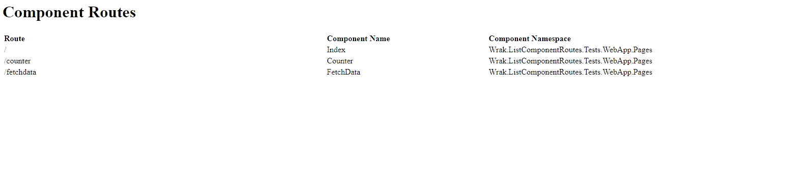

# ListComponentRoutes Middleware Package

A middleware nuget package for listing all routeable Razor components in an ASP.NET Core app. 

(Big shout out to Steve Smith (aka [Ardalis](https://github.com/ardalis)) for his work on [AspNetCoreStartupServices](https://github.com/ardalis/AspNetCoreStartupServices), from which I borrowed heavily to piece this together).

# Getting Started

1. Install NuGet package

```
PM> Install-Package Wrak.ListComponentRoutes
```
2. Add the following to Startup's using statements:

```
using Wrak.ListComponentRoutes;
```

3. Add the following at **the bottom of** Startup's `ConfigureServices` method:

```
services.AddListComponentRoutes(options =>
{                
    options.Path = "/my-custom-path"; // Optional - default path is '/routes'
    options.Assemblies = new[] { typeof(Startup).Assembly };
});
```
4. Add the following to Startup's `Configure` method (in an if block so it only runs in Development)
```
if (env.IsDevelopment())
{
    app.UseListComponentRoutes();
    app.UseDeveloperExceptionPage();
}
```
If it's working you should see output like this listing all routeable Razor components in the configured assembly or assemblies:



